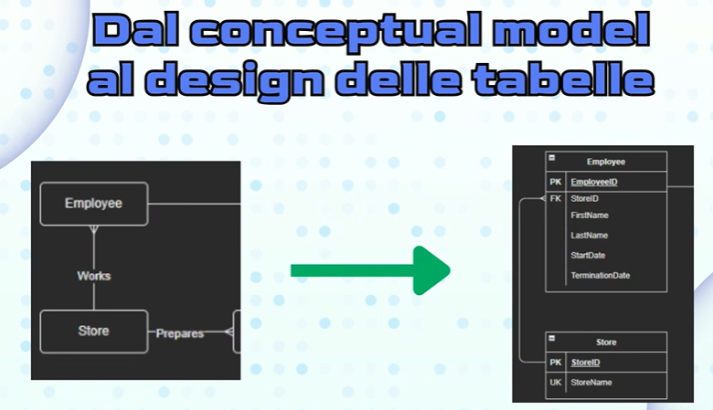
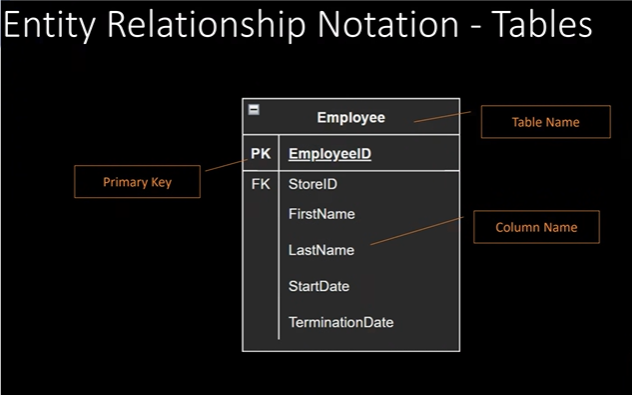
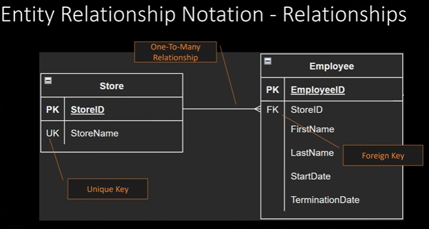
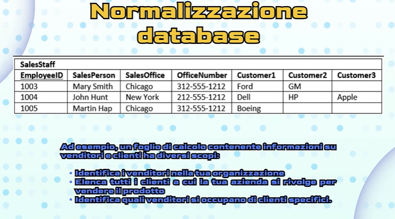
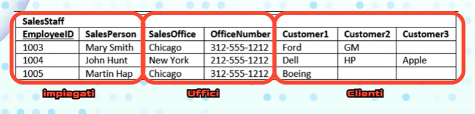
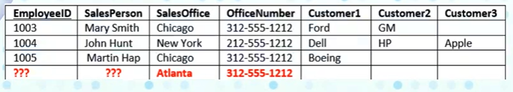
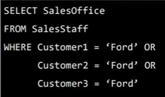

Parliamo di schemi UML , usati principalmente per gestire le classi

I segni usati per indicare dei dati privati o pubblici sono '-' per i privati e '+' per i pubblici

Crow's Feet Notation (per le relazioni tra le entità)
Nel caso del 'One and only one' non può essere vuoto e non possono essere molti
Per esempio l'ordine di un User in una pizzeria , l'Order sarà collegato con 'Many' ma User sarà per forza One and only one perchè intanto non possiamo
avere più User dello stesso ordine perchè non sapremmo a chi mandarlo e allo stesso tempo non può essere vuoto perchè dobbiamo sapere a chi mandare l'ordine

Il database deve poter includere tutte le possibilità senza creare dei danni , non bisogna pensare solo ai dati di quel esatto momento , ma anche al futuro contando che le cose possano mutarsi e quindi bisogna pensare a un modo per non sovrascrivere e perdere i dati che registrerai 

# ROADMAP
Dal conceptual model al design delle tabelle

Per costruire un database bisogna seguire un Diagramma ER
Esistono diversi modi per rappresentare i disegni , il più usato è il ID

Quando si usa il Diagramma ER?
Si usa in fase di progettazione , scomponendo il problema in passi più piccoli e aiutare a visualizzare le relazioni
Per eseguire il debug di un database
Per rappresentare graficamente la struttura del database

Struttura di una possibile tabella:

(l'id deve essere un intero (int) autoincrementale)
La primary key diventa PK
La foreign key diventa FK (chiave esterna in italiano) (le foreign sono le primary key ,PK , di un altra tabella)

Di norma si struttura con al primo posto la PK , subito sotto le FK e dopo ciò che caratterizza la tabella

Implementazione:

(La freccia one to many non è messa a caso la sua posizione , è messa la perchè parte da StoreID e finisce sullo StoreID dell'altra tabella , non sopra andando sulle PK)
La unique key diventa UK

Standard dell'industria , la primary key sarà sempre in grassetto sottolineata

# Normalizzazione del database
è un processo con cui viene data una forma specifica alle tabelle del nostro database

Ogni tabella deve avere un argomento soltanto , non bisogna unire più argomenti

Esempio di tabella incubo, schifosa che unisce più argomenti:

Ha ben 3 argomenti, cosa che non va bene
Nell'argomento 'Uffici' c'è una riga che si ripete due volte , cosa che non va bene

Perchè bisogna normalizzare?

Ridurre al minimo i dati duplicati
Ridurre o evitare problemi quando vengono modificati i dati
Semplificare e standadizzare le query
Evitare crash improvvisi

Problema n.1 nella tabella
Data duplication (informazioni duplicate)

Problema n.2 nella tabella
Data anomalies
Ci sono 4 anomalie nella tabella , cioè:

Se voglio aggiungere un quarto customer non posso , perchè la tabella ne permette massimo 3

C'è un anomalia di cancellazione perchè se una persona non lavora più , io devo cancellare tutta la riga e perdere anche le altre informazioni

C'è anche un anomalia di inserimento , come posso inserire una nuova sede senza però sapere se c'è personale , le loro informazioni e altre info:

C'è un anomalia sulla estrazione tramite QUERY:
