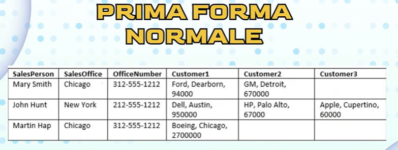
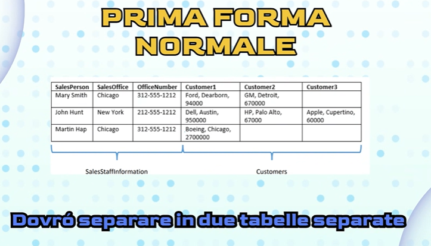
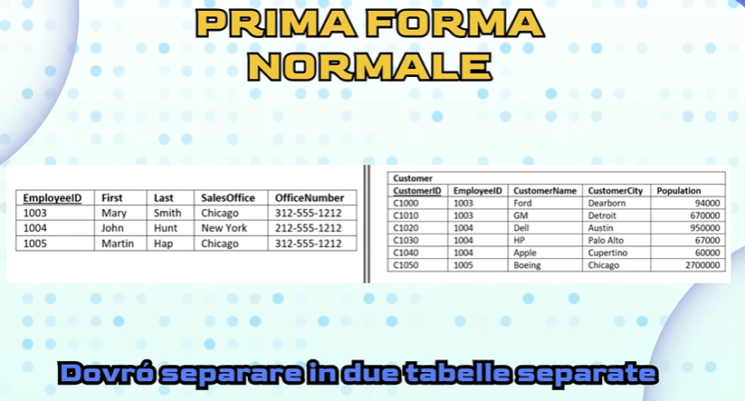
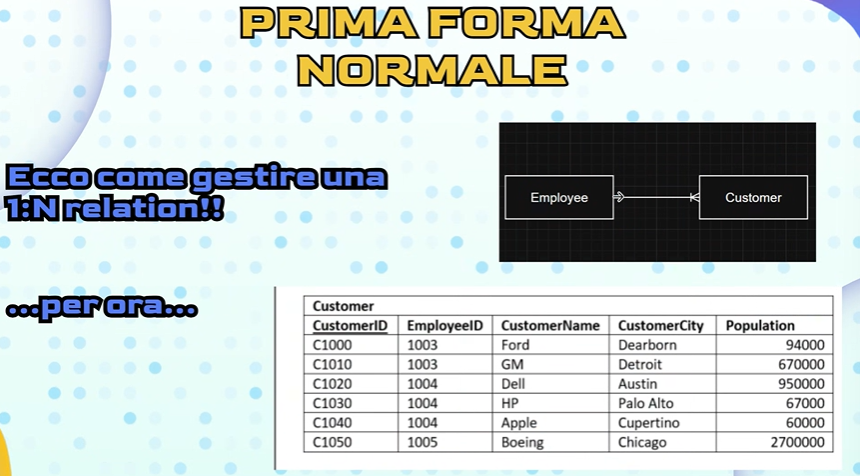
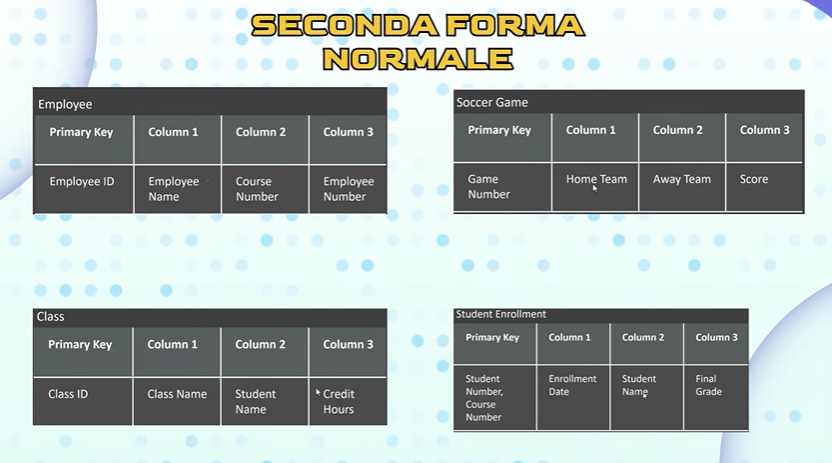
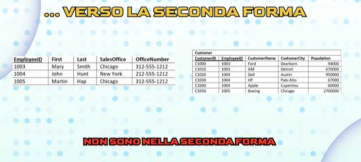
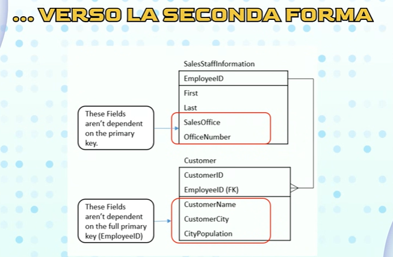

# Valori atomici

# Forme della normalizzazione 
Le forme sono progressive , ciò significa che per soddisfare la 3* forma normale , una tabella deve prima rispettare le regole della 2* forma normale , e la 2* forma normale deve rispettare quelle della 1* forma normale

## Forma zero
Sarebbe il conceptual model

## Prima forma normale
Sarebbe la tabella
Le informazioni sono memorizzate in una tabella relazionale e ogni colonna contiene valori atomici, e non ci sono gruppi di colonne ripetuti.

Esempio spiegazione:

Esempio prima forma normale. ma ancora con problemi:

Problemi:

Soluzione per risolvere parzialmente step by step:
1. Avere una chiave primaria
2. Solo valori atomici 
3.  Assicurarsi che non ci siano colonne/tabelle che si ripetono

Dividere gli argomenti con una propria tabella

Questo design è superiore rispetto alla nostra tabella originale in diversi modi, poichè non c'è nessun limite di clienti , è possibile ordinare i clienti , filtrare i clienti è più semplice e rimosse le anomalie di inserimento ed eliminazione

(Chicago si ripete due volte ancora , ma proprio perchè stiamo procedendo step by step ci sono ancora errori)

**Ma rimangono ancora problemi!**

Come gestire la relazione tra la tabella Customer e Employee, per ora:

(La connessione sarà fatta tramite la PK della tabella Employee , cioè EmployeeID)

La prima regola fondamentale per una tabella relazionale è usare gli int autoincrementali

## Seconda forma normale
La tabella è in prima forma normale e tutte le colonne dipendono dalla chiave primaria della tabella
(no dipendenza parziale)

**Esercizio** per capire meglio, cosa dipende e cosa non dipende?

1* Tabella giusta
2* Tabella , la terza colonna non è un valore atomico
3* Tabella , StudentName non c'entra
4* Tabella giusta per ora ma , lo StudentName non dipende da entrambe le PK ma solo , questa si chiama dipendenza parziale

**Per essere in seconda forma normale , la dipendenza dalla PK deve essere totale/diretta, non va bene la parziale**

Una **chiave primaria composta** è formata da due o più chiavi primarie

## Terza forma normale
La tabella è in seconda forma normale e tutte le sue colonne non dipendono transitivamente dalla chiave primaria

# Dipendenza dalla primary key

La population non c'entra nulla però con l'argomento della tabella , la popolazione della città a cui appartiene non ha collegamenti col customer, la tabella serve a descrivere il customer

Perciò questa colonna descrive uno specifico aspetto legato all'entità collegata alla PK?

Se si , si dice che ha una dipendenza da PK 
Se no , si dice che ha una indipendenza da PK

La risposta è si

L'impiegato che gestisce il cliente , descrive un aspetto del cliente? Si. Il nome del cliente descrive un aspetto del cliente? Si. La città in cui vive il cliente , descrive un aspetto del cliente? Si. La popolazione della città in cui vive descrive l'aspetto del cliente? Sni.
(Dipendenza transitiva)

