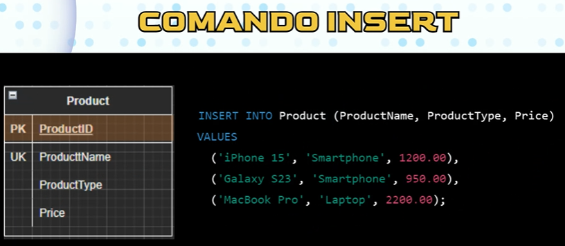

# Programmazione Ad Oggetti

Nella p.o i principali formati sono int,float,double,boolean etc
Però possiamo creare anche delle variabili custom,ma il programma inizialmente
non sa come sono fatte.

Quindi spiego al sistema quali sono le istruzioni per crearmi queste variabili
custom,tramite la “Classe”.

Nella classe posso definire un insieme di stringhe e formati che viaggiano assieme
e stanno raggruppate, quindi tramite una classe posso creare degli schemi.
Poi creo una variabile che segue quel determinato schema.

Esempio:
variabile: Utente
Che contiene (nome,cognome,datadinascita,email)

Grazie alla programmazione ad oggetti posso creare anche dei metodi, funzioni
molto precise che lavorano unicamente con oggetti.

La filosofia è l’incapsulamento: dare struttura alle nostre informazioni, come se
definissi un protocollo.

Ad esempio grazie alla funzione “is_adult() “ capisco subito se quella persona è
maggiorenne o no.

Esistono classi padre e classi figlie, le classi figlie di solito sono quelle molto più
dettagliate che ereditano tutte le variabili delle classi padre.
Ad esempio USER classe padre ed EMPLOYEE e CUSTOMER le classi figlie.

# SQL Command Categories

- DQL (Data Query Language)

- DML (Data Manipulation Language): CRUD

- DDL (Data Definition Language): Crea il database

- DCL (Data Control Language): Si occupa della sicurezza del database , dei ruoli nello specifico

Esempio idea di creare una tabella da uno script di comando:

## Vincoli
Esistono 4 tipi di vincoli principali
- Primary Key
- Foreign Key 
- Unique Key
- Not Null

L'esistenza di una chiave esterna in un database , serve anche a vincolare l'esistenza dei dati all'interno del database. Cioè , se una persona è associato a un office , io non posso eliminare quell'office perchè lascerebbe l'office di riferimento della persona vuoto. Questo vincolo serve per impedire la creazione degli 'orfani' 

Per eliminare l'office prima devo cancellare/licenziare le persone associate a quell'office

### Primary Key Constraint

### Foreign Key Constraint

**DDL COMMANDS**

### Query Commands

**COMANDO INSERT**

Comando per prodotti 1 a 1

Comando per tutti i prodotti in una botta

**COMANDO UPDATE**

Comando ''rischioso'' per aggiornare un dato

**Appunto sul comando**

**Modifiche si più righe**

**Evitare errore**

 Manca la condizione where e modifica tutta la riga 'Price' e 'ProductType'

**Approfondimenti**
Non è meglio mettere un controllo? Certo , prende il nome di **autocommit**.

**Regola generale importante:**
Prima si popolano le tabelle "padri" , cioè le PK
Poi si popolano le tabelle "figli" , cioè le FK

**COMANDO DELETE**

'''sql
DELETE FROM Product
WHERE Price < 1000;

'''

**COMANDI DML**

Piccola differenza:

Replace non è buonissimo a seconda del lavoro da fare , perchè elimina il dato vecchio e ne crea uno nuovo , però c'è il rischio che un dato rimanga vuoto

Meglio usare 'Merge' perchè controlla se è presente il dato e fa l'update sennò lo inserisce

### Differenza tra Deletion Fisica e Logica

**Deletion Fisica**

**Deletion Logica**

Strategie automatizzazione

Perchè generare dati finti?
10 Dati per un esempio veloce
1000 Dati per testare query più complesse
100.000 Dati per simulare carichi di performance

Librerie utili:
Faker (gratis)
Mockaroo (pagamento)