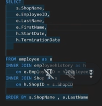
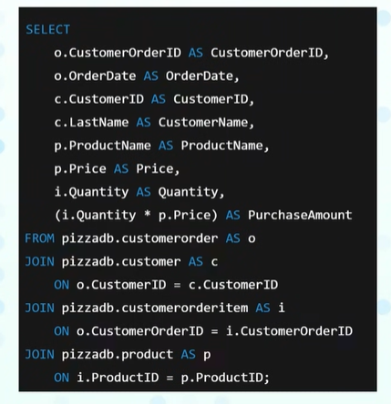
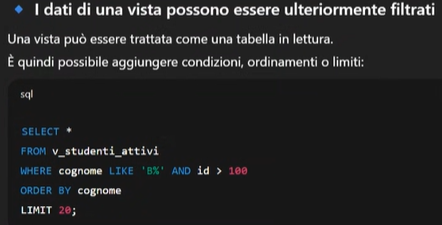

# Prove pratiche sul database 'pizzadb' tramite SQLTools

SELECT * FROM coupon WHERE CouponID = 5;

SELECT
    ProductID,
    ProductName,
    ProductType,
    Price,
    (Price * 1.04) AS PriceMaggiorato
FROM product

SELECT
    ProductID,
    ProductName,
    ProductType,
    Price,
    (Price * 1.04) AS PriceMaggiorato,
    (Price * 1.04 - Price) AS ValoreMaggiorazione,
    (CONCAT(ProductName, ' ', ProductType)) AS NomeCompleto
FROM product

Per arrotondare i numeri con la virgola usare 'ROUND':
   ROUND(Price * 1.04, 2) AS PriceMaggiorato

### Comando per i filtri
 WHERE ProductType = 'PIZZA' OR ProductType = 'DESS'

### Alternativa più veloce
 WHERE ProductType IN ('PIZZA', 'DESS') 

### Per escludere un tipo , diverso da
 WHERE ProductType <> 'PIZZA'

### Alternativa più veloce
 WHERE ProductType NOT IN ('PIZZA', 'DESS')
 WHERE Price <= 3 OR Price > 10
 ORDER BY Price

### Alternativa più veloce
 WHERE Price BETWEEN 3 AND 10

### Per cercare tramite la fine o l'inizio di lettere precise
WHERE ProductType LIKE '%ri%'
%ri = trova tutte le parole che finiscono con 'ri'
ri% = trova tutte le parole che iniziano con 'ri' 
%ri% = trova tutte le parole che hanno 'ri' al suo interno

SELECT
    CustomerName,
    ProductName,
    Count(*) AS NumeroOrdini
FROM customerorderdetail
GROUP BY CustomerName, ProductName

Il count ci serve per sapere effettivamente quante volte quel prodotto è stato ordinato , perchè sennò non lo vedremmo

SELECT
    e.EmployeeID,
    e.FirstName,
    e.LastName,
    h.StartDate,
    h.TerminationDate
FROM Employee as e
INNER JOIN employeehistory as h
on e.EmployeeID = h.EmployeeID
ORDER BY e.LastName, h.StartDate

