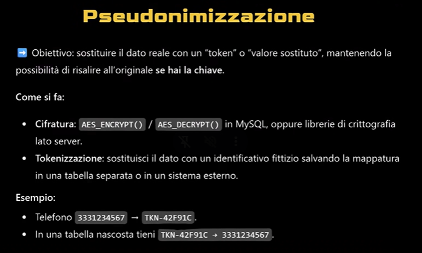
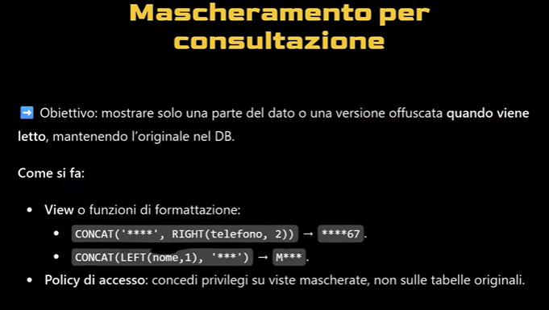
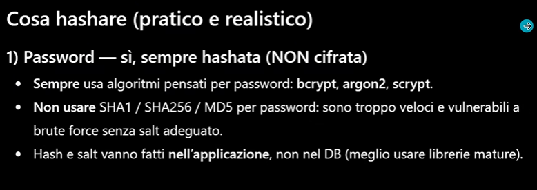
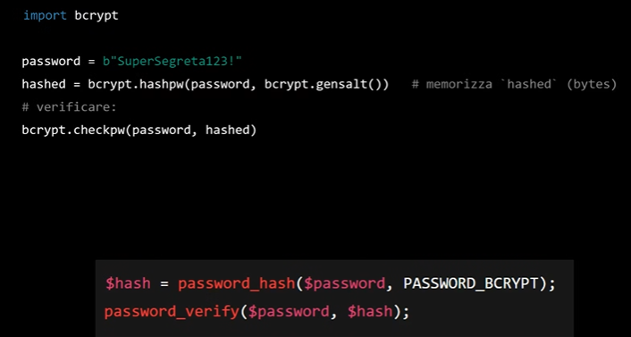
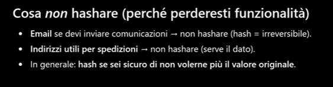
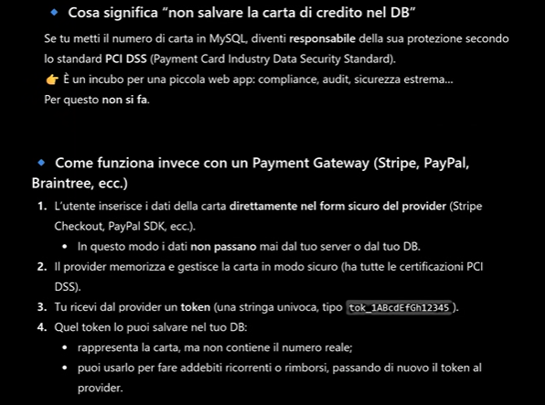
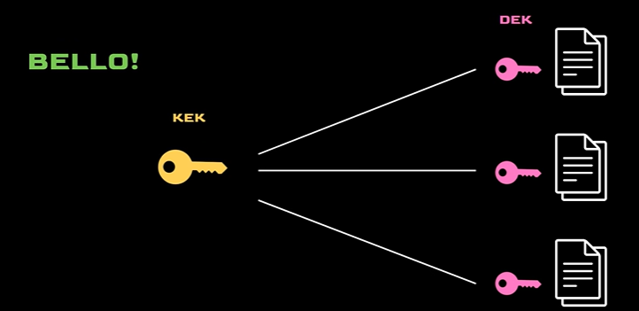
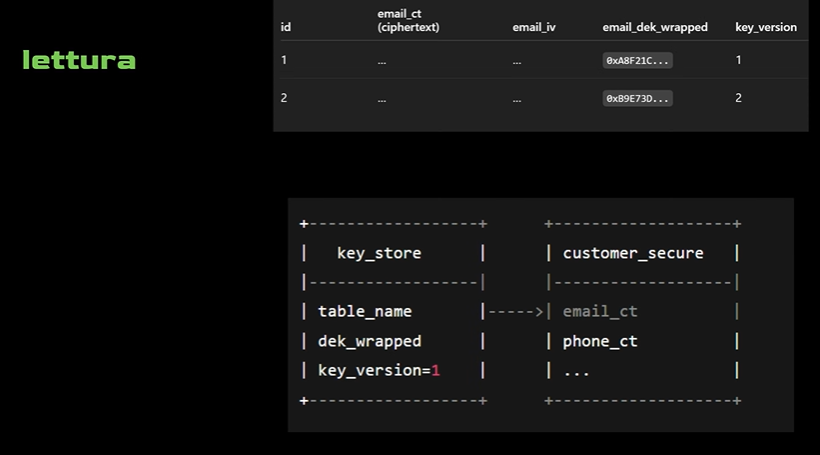
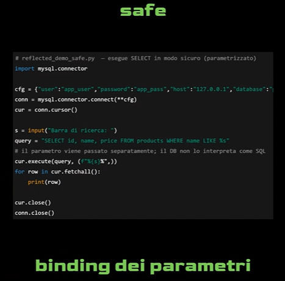

# Pseudonimizzazione

# Mascheramento per consultazione

## Cosa si hasha e come farlo?

## Cosa non si hasha?

# Come gestire le carte di credito

# Anonimizziamo e cifriamo lato db o lato server?

Lato server con le api viene gestita la cifratura

# Safe binding dei parametri

